# GDSC-FrontEnd-ReactJs
Repositori ini merupakan repositori lanjutan dari repositori sebelumnya yaitu repositori [GDSC-FrontEnd](https://github.com/Dimas-Saputra-Me/GDSC-FrontEnd). Repositori ini berisi tentang kode website yang menampilkan beberapa list film dengan properti tiap film yaitu director, publisher, dan sinopsis film. Data properti diambil melalui online rest api JsonPlaceHolder. Pada website ini juga terdapat fitur search bar untuk mencari film berdasaran nomor ID yang tersedia. Pengguna juga dapat melihat detail film menggunakan tombol view detail. Pada halaman about berisi profil singkat.
\
\
Repositori saat ini menggunakan framework React Js dari sebelumnya masih kode native. Terdapat beberapa fitur baru lanjutan dari repositori sebelumnya, yaitu fitur wishlist pengguna dapat menambahkan wishlist film yang dapat di kostumisasi oleh pengguna. Selain itu juga terdapat penambahan sistem cookies untuk menyimpan data wishlist pengguna.
\
\
Kunjungi halaman [Github pages](#) untuk melihat website. 
\
\
**Jangan lupa star-nya, terima kasih.**
\
**Repositori ini dibuat untuk keperluan tugas FrontEnd GDSC-ITB**

# Website Previews

## Desktop Preview
### Homepage
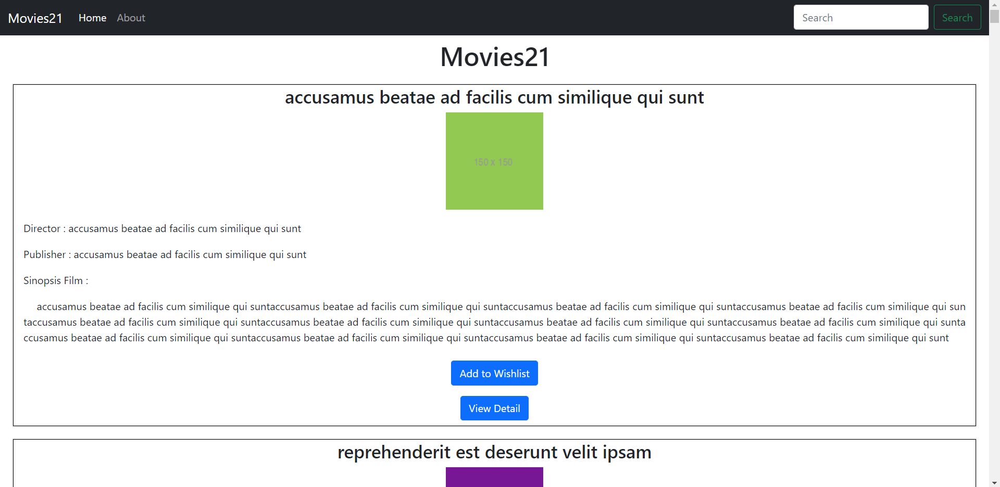
### Wishlist
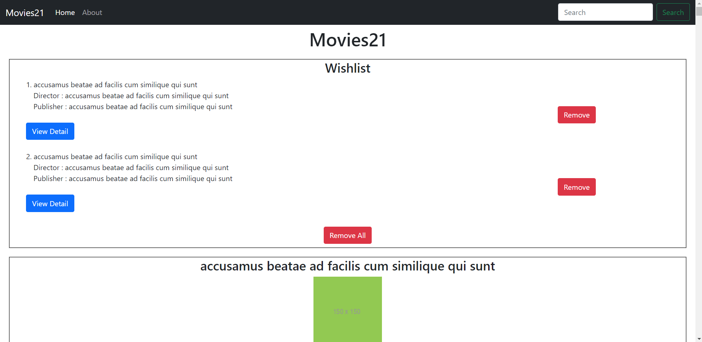
### Detail Page
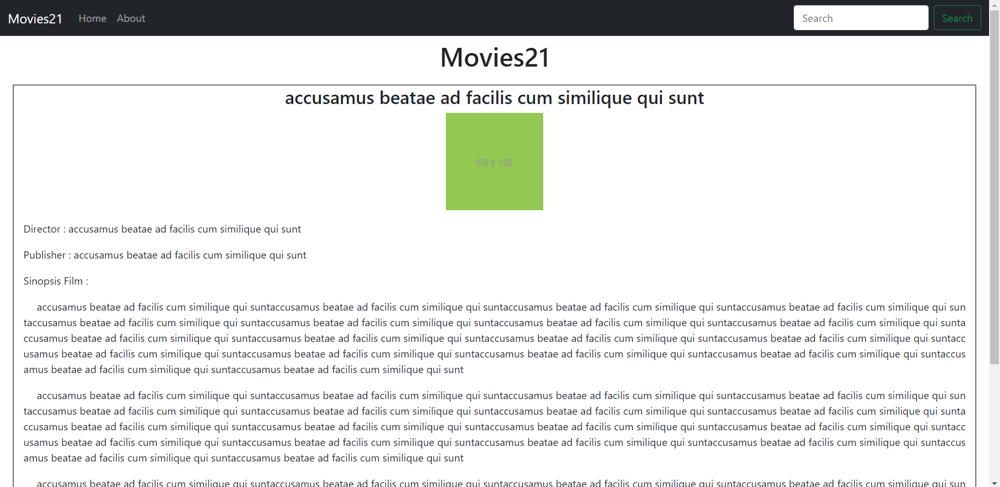
### Search Page
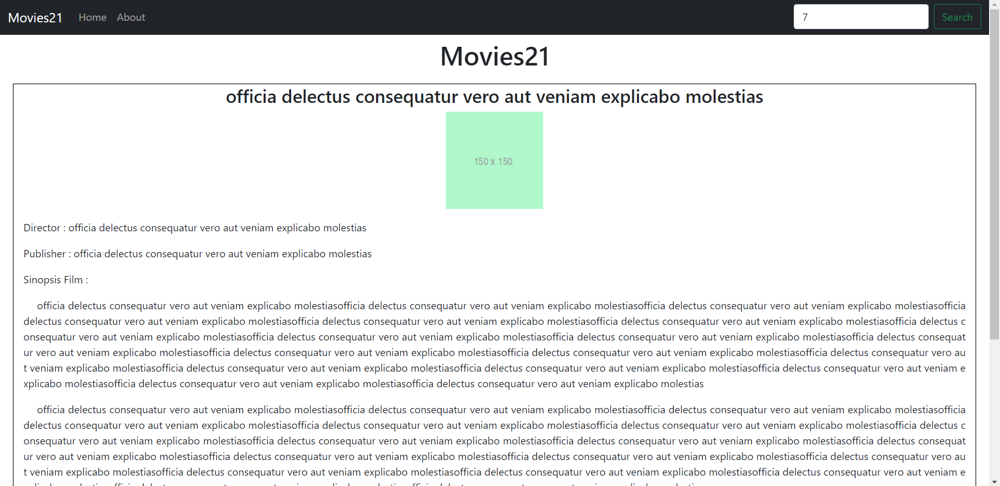
### About Page
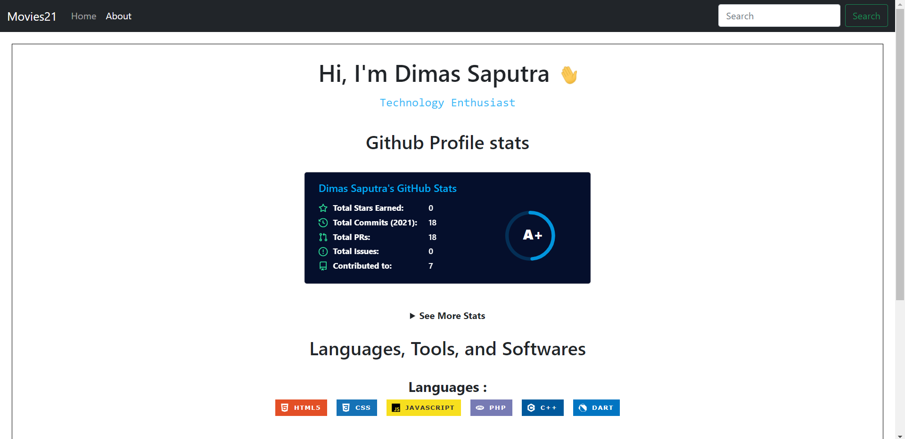

## Mobile Preview
### Homepage
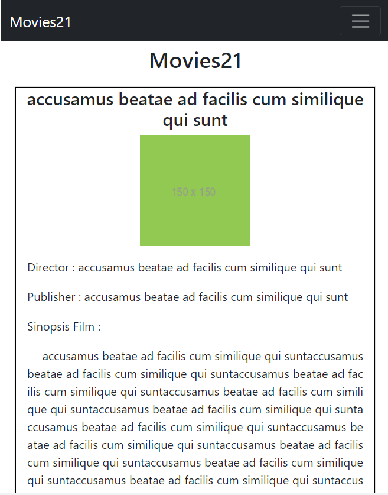
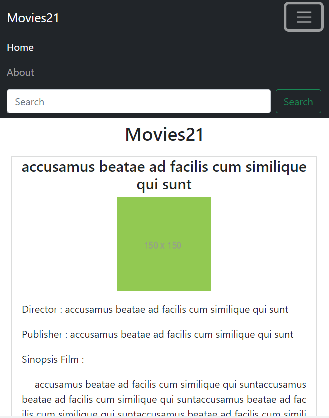
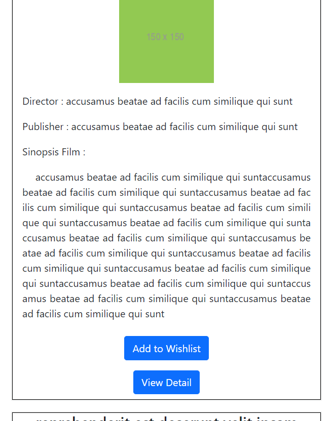
### Wishlist
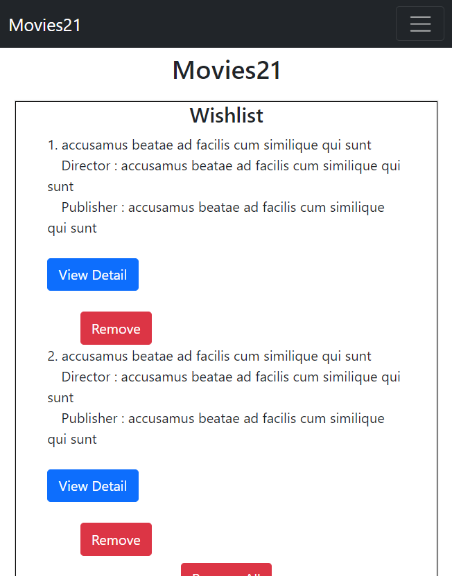
### Detail Page
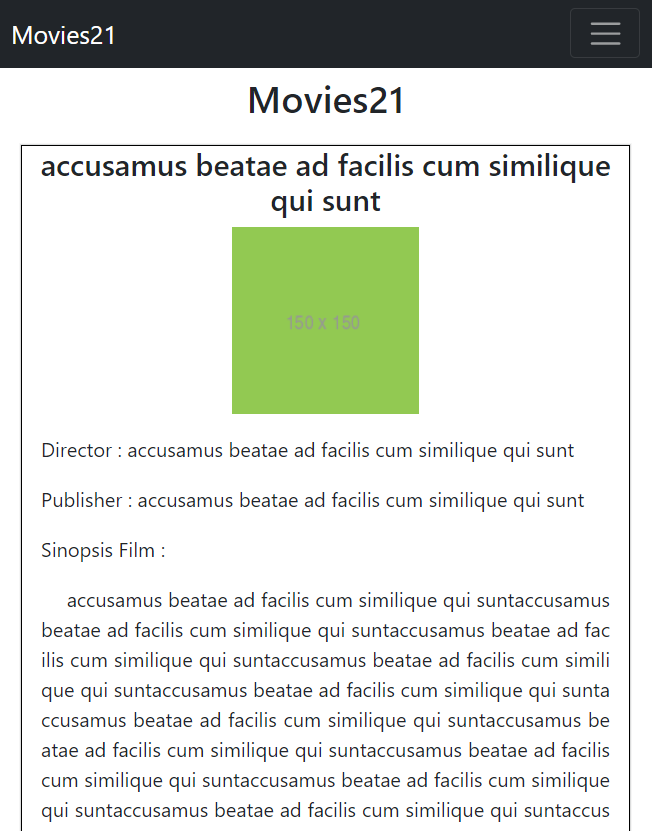
### Search Page
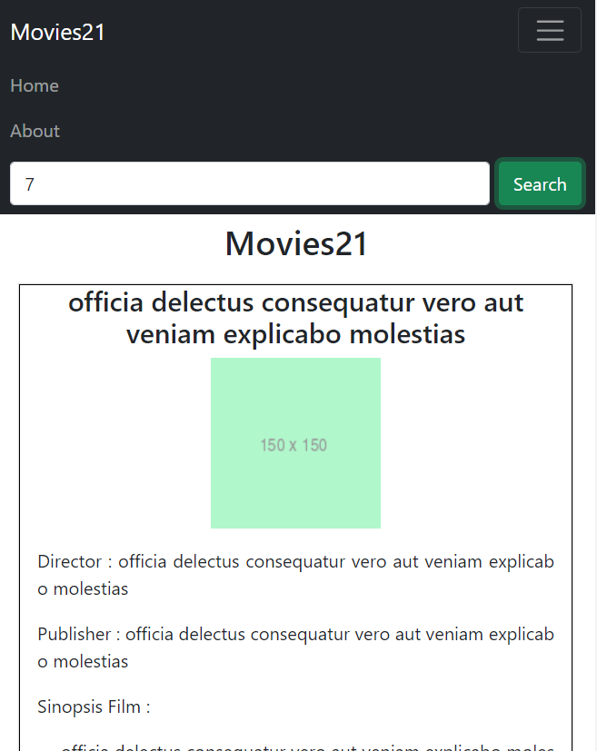
### About Page
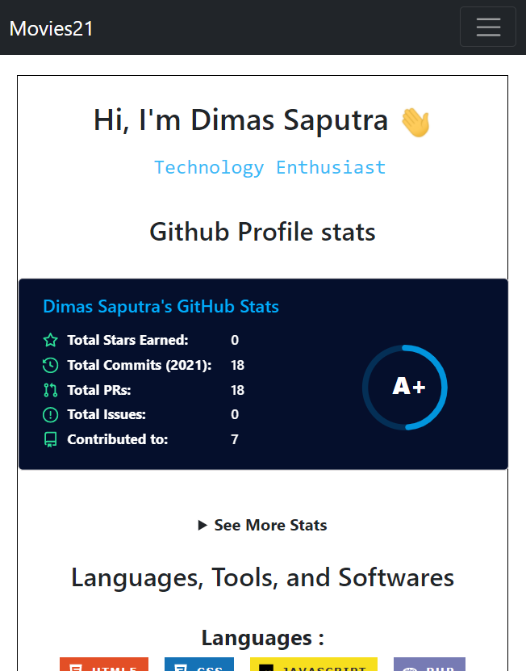

## Features
- Search movie with available ID
- Using [JsonPlaceHolder API](https://jsonplaceholder.typicode.com/)
- Live Website With [Github pages](#)
- Responsive website (Desktop or Mobile)
- Custom Wishlist Movie
- Wishlist data Cookies

## Packages
- [axios](https://www.npmjs.com/package/axios)
- [react-router-dom](https://www.npmjs.com/package/react-router-dom)
- [react-bootstrap](https://www.npmjs.com/package/react-bootstrap)
- [react-cookie](https://www.npmjs.com/package/react-cookie)

## Credits
- Credits API = https://jsonplaceholder.typicode.com/
